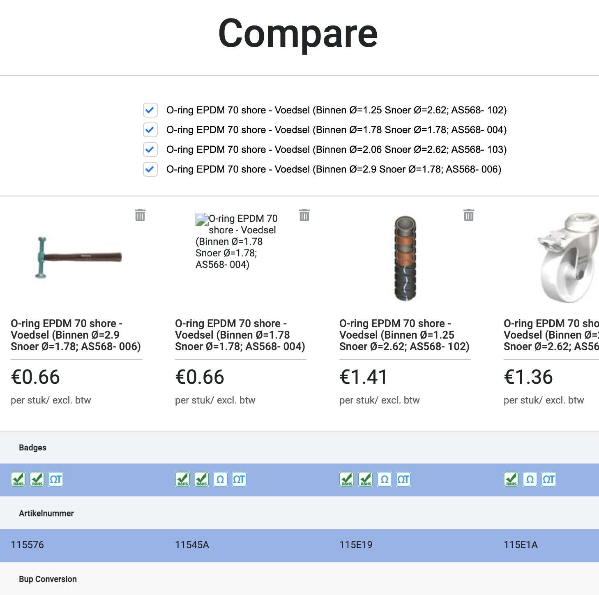
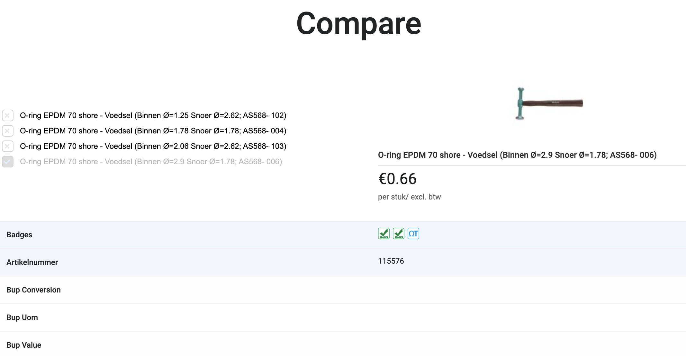
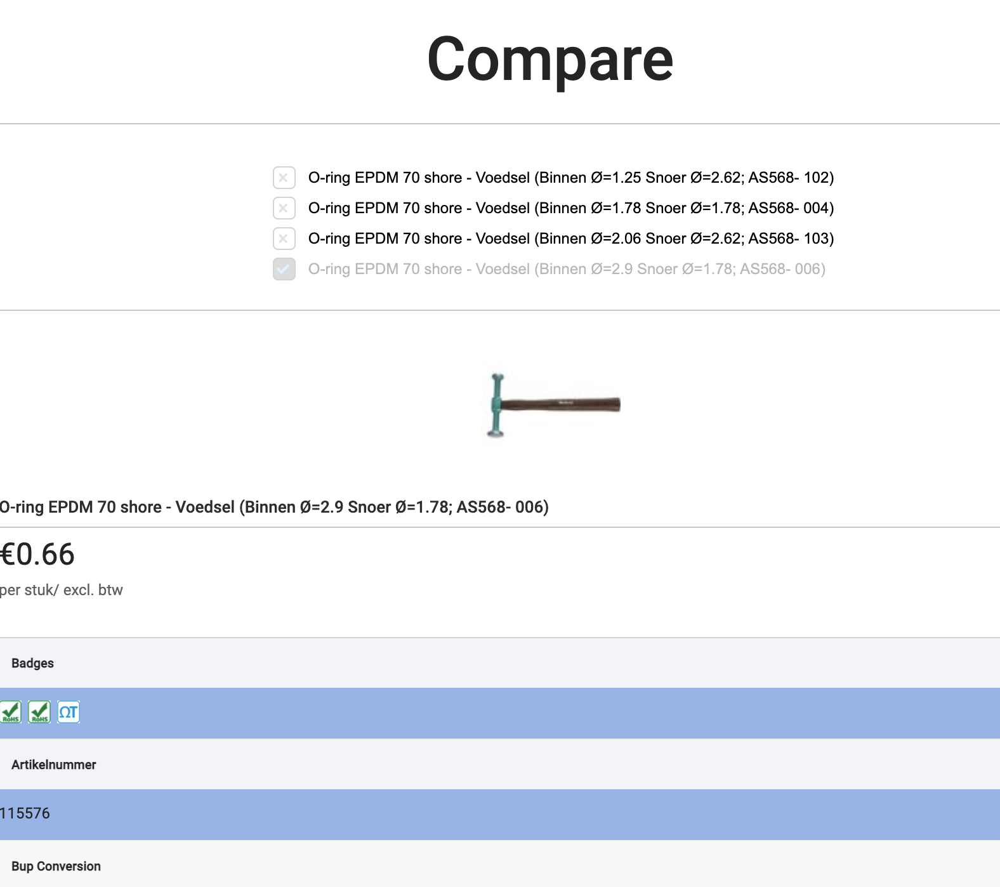

# Getting Started with product comparison App

This project allows to compare max 4 products and show specifics.
App is not allowed to deselect all products on the list. 

Simple api used :
http://5c35e7f96fc11c0014d32fcd.mockapi.io/compare/products

## Available Scripts

In the project directory, you can run:

### `yarn install`

Install packages before you run this app.

### `yarn start`

Runs the app in the development mode.\
Open [http://localhost:3000](http://localhost:3000) to view it in the browser.

The page will reload if you make edits.\
You will also see any lint errors in the console.

### `yarn test`

This allows to run jest test ( testing libary )
And will show coverage summary.

## Essential Requests

- [x] Show and hide products
- [x] Highlight differences between product features
- [x] Features ordered alphabetically by feature name
- [x] Badges should be placed before features

- [x] According to the API, the following keys are not product features to compare:
      salePrice, manufacturerName, grossPrice, BUP_UOM, BUP_Value, uom, productImage, BUP_Conversion, minQuantity, manufacturerImage, name, sku, listPrice, channel, display, atp (v)

## Optimal Requests

- [x] Webpack

- [x] Styled components
      **More to improve:Should use more global variable for colors**

- [x] Responsiveness
      **stick header is not fully working from mediume size devices**
      **currencly used scroll x and y...**
      **have to more improve**

- [ ] Browser backward compatibility (IE11)

- [x] Delivery the exercise with a readme file that explains what you have done and how to run your project.

## Quick overview

  **No.1**
  
  **No.2**
  
  **No.3 - when user selected only 1 product**
  
  **No.4 - from middle size screen**
   
  **No.5 - from middle size screen**
   

